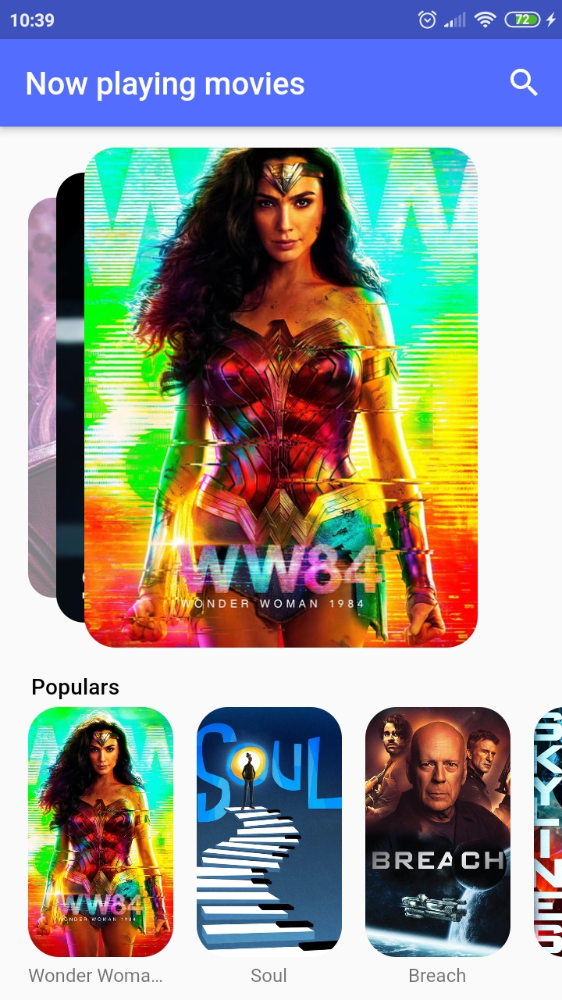
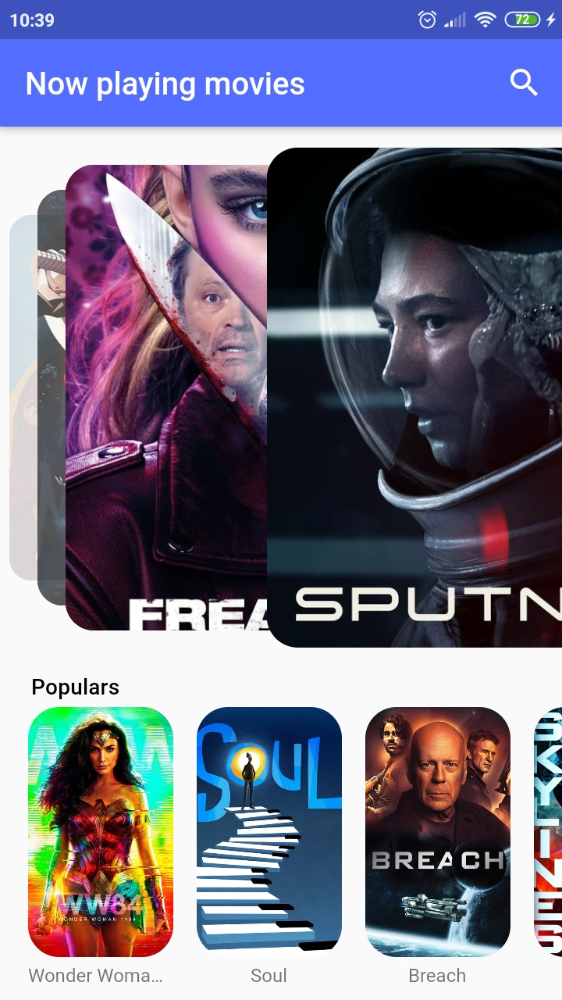
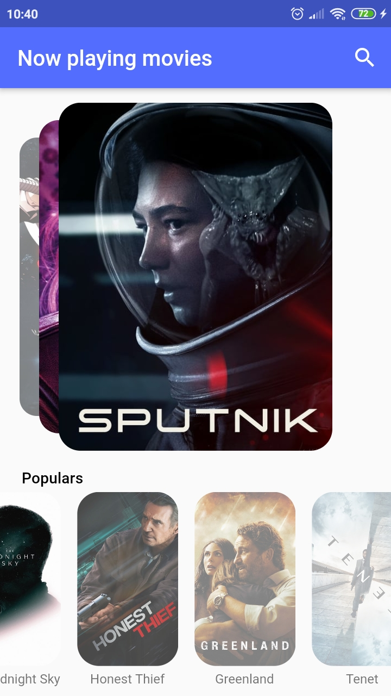
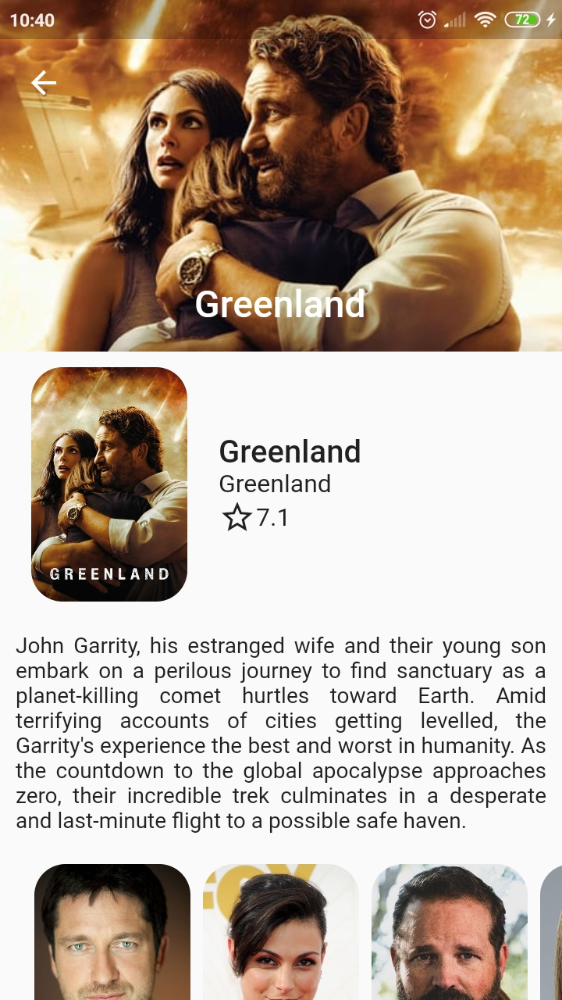
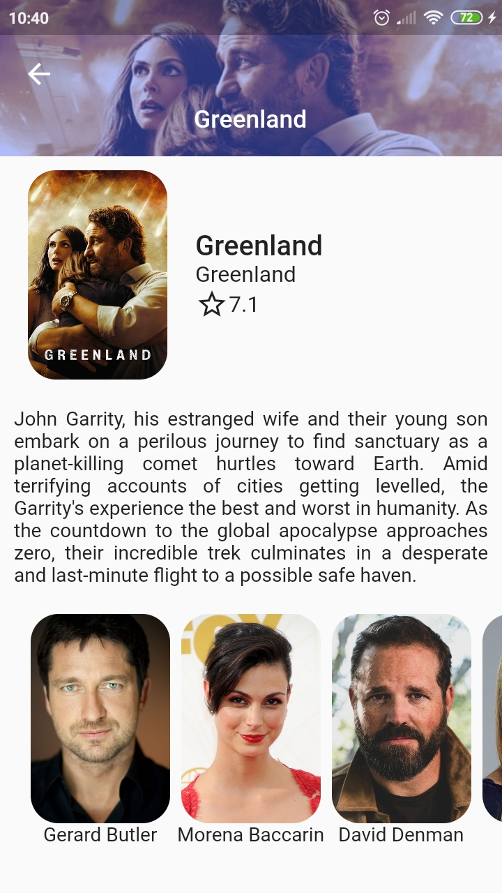
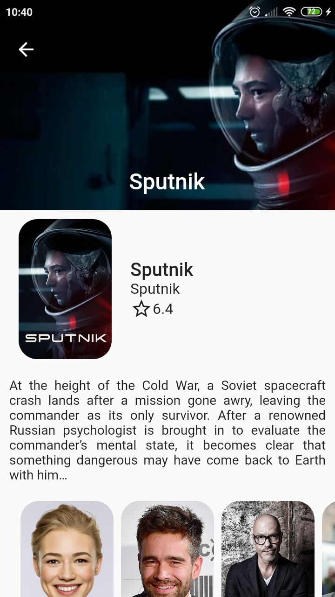
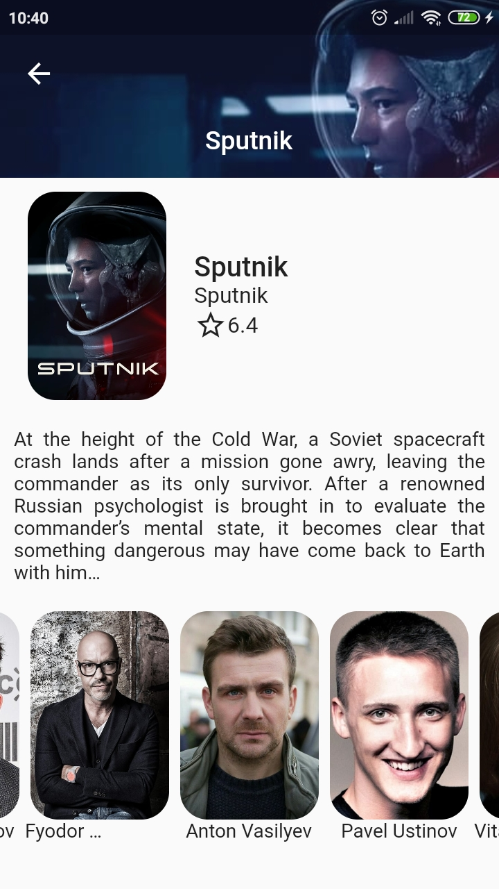
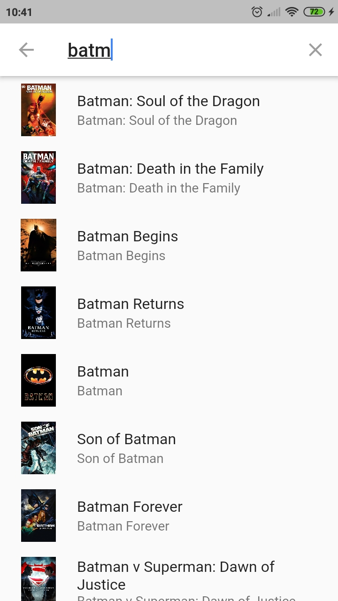
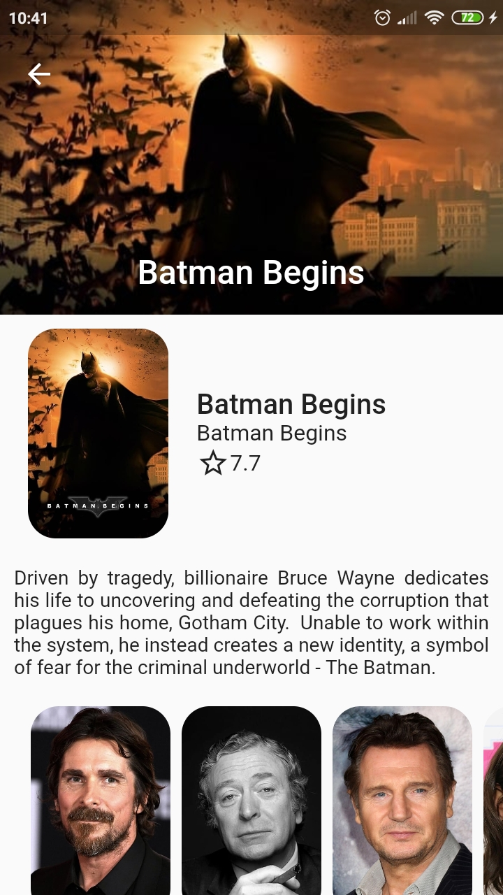

# flutter_themoviedb

A Flutter app that consumes TheMovieDB API.

## App Features
The app has the following features:
- fluter_swiper plugin, using Swiper and PageView Widgets
- HTTP requests and JSON mapping
- Bloc pattern, using StreamControllers, Streams and StreamBuilders
- FutureBuilder
- Infinite Scroll
- Hero animation
- Search bar
- Custom Widgets
- Custom default app icon

## Screenshots

